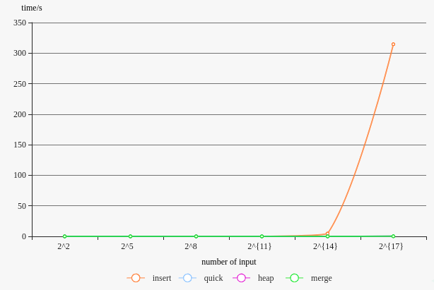
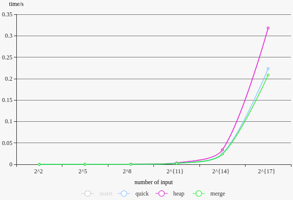
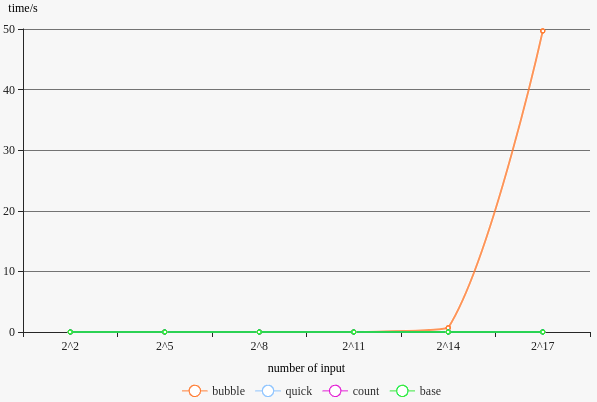
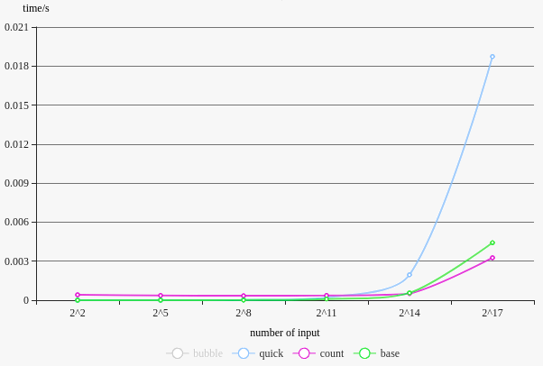

# Project 1 report

宋小牛 PB15000301

[TOC]

## 实验要求

* 使用插入排序、堆排序、归并排序、快速排序算法对一定量字符串进行排序并测试比较分析性能
* 使用冒泡排序、快速排序、计数排序、基数排序算法对一定量正数进行排序并测试比较分析性能

##实验环境

编译环境：gcc 5.4.0 on Ubuntu 16.04

CPU：Intel(R) COre(TM) i7-4710HQ, 2.50GHz

内存：8GB

## 文件、代码结构

* `input`
  * `random.cc`: 用于生成随机数据
  * `input_string.txt`: 储存所有随机数据
* source
  * `*.cc`: 排序算法，\*为排序算法名称
  * `run.sh`: 编译、运行的脚本，会将指定的算法的各数量级都运行一遍并保存时间结果
* output:
  * `*_sort`: 存有算法名为\* 的排序结果与时间结果
    * `result_n.txt`: 数量级为$2^n$的排序结果，其数据来自`input_string.txt`的前$2^n$项
    * `time.txt`: 该算法的各数量级的消耗时间

### ex1

#### 生成随机数据

```c++
#include <iostream>
#include <fstream>
#define num 0x20000
int main() {
    std::ofstream f;
    f.open("input_string.txt", std::ios::out);
    srand((unsigned)time(NULL));
    for (int i = 0; i < num; i++) {
      	// size of the string is random too
        int size = rand() % 32 + 1;
        for (int j = 0; j < size; j++) {
            f << (char)('a' + rand() % 26);
        }
        f << '\n';
    }
    f.close();
    return 0;
}
```

#### 算法代码结构

```c++
#include <iostream>
#include <fstream>
#include <chrono>
#include <string>
#include <sstream>
// get length of string
int lenstr(char* s) {
    int i = 0;
    for (; i < 32 && s[i]; i++);
    return i;
}

// compare two string
int cmpstr(char* s1, char* s2) {
    int i = 0;
    int l1 = lenstr(s1), l2 = lenstr(s2);
    if (l1 > l2) return 1;
    if (l1 < l2) return -1;
    for (i = 0; s1[i] == s2[i] && s1[i] != '\0'; i++);
    if (s1[i] < s2[i]) return -1;
    if (s1[i] > s2[i]) return 1;
    return 0;
}
int main() {
    std::fstream f;
    f.open("../input/input_string.txt");
  	// number comes from compile, like this:
  	// g++ insert.cc -D number=256 -std=c++11
    char s[number][33];
    char* result[number];
    // get string from file and set a pointer array to avoid too many strcpy
    for (int i = 0; i < number; i++) {
        f >> s[i];
    }
    f.close();

  	// get start time 
    auto start = std::chrono::system_clock::now();
  
    /*======================== sort body ============================*/
  	// do sort here
    /*======================== sort end =============================*/
  
  	// get end time
    auto end = std::chrono::system_clock::now();
    auto duration = std::chrono::duration_cast<std::chrono::microseconds>(end - start);
    auto time_cost = double(duration.count()) * std::chrono::microseconds::period::num / std::chrono::microseconds::period::den;
    std::cout << "time:" << time_cost << std::endl;
  
	// write sort result to output file
    std::stringstream tmp;
    tmp << number;
    std::string filename = "../output/insert_sort/result_" + tmp.str() + ".txt";
    f.open(filename, std::ios::out);
    for (int i = 0; i < number; i++) {
        f << result[i] << '\n';
    }
    f.close();
    return 0;
}
```

各算法代码均如上，仅其中排序部分内容不同。排序部分代码均直接从书上伪代码修改而来。

#### 运行脚本

```shell
#!/bin/bash
k=2
# $1 is the name of sort algorithm which comes in as a parameter
rm ../output/$1_sort/time.txt
for ((i=4;i<131073;i=i*8))
do 
    g++ $1.cc -D number=$i -std=c++11
    ./a.out >> ../output/$1_sort/time.txt
    mv ../output/$1_sort/result_$i.txt ../output/$1_sort/result_$k.txt
    k=$[k+3] 
done
```

排序代码中通过标准输出打印的时间消耗在此被重定向写至文件中

#### 运行方法

dir: `ex1/source`

```bash
./run.sh insert
```

其中`insert`可替换为其他算法名称：`heap`、`quick`、`merge`

运行完毕后将在`output`中对应算法文件夹内看到结果


### ex2

#### 生成随机数据

```c++
#include <iostream>
#include <fstream>
#define num 0x20000
int main() {
    std::ofstream f;
    f.open("input_string.txt", std::ios::out);
    srand((unsigned)time(NULL));
    for (int i = 0; i < num; i++) {
        int rst = rand() & 0xffff;
        if (!rst) {
            i--;
            continue;
        }
        f << rst << '\n';
    }
    f.close();
    return 0;
}
```

由于要求数据范围为 1 ～ 65535，故随机数为 0 时将其丢弃

#### 算法代码结构

```c++
#include <iostream>
#include <fstream>
#include <chrono>
#include <string>
#include <sstream>
int main() {
    std::fstream f;
    f.open("../input/input_string.txt");
    int s[number];
  	// get random number from file
    for (int i = 0; i < number; i++) {
        f >> s[i];
    }
    f.close();

  	// get start time
    auto start = std::chrono::system_clock::now();

  	// sort start
  	// do sort here
	// sort end
  
  	// get end time
    auto end = std::chrono::system_clock::now();
    auto duration = std::chrono::duration_cast<std::chrono::microseconds>(end - start);
    auto time_cost = double(duration.count()) * std::chrono::microseconds::period::num / std::chrono::microseconds::period::den;
    std::cout << "time:" << time_cost << std::endl;

  	// write sort result to output file
    std::stringstream tmp;
    tmp << number;
    std::string filename = "../output/quick_sort/result_" + tmp.str() + ".txt";
    f.open(filename, std::ios::out);
    for (int i = 0; i < number; i++) {
        f << s[i] << '\n';
    }
    f.close();
    return 0;
}
```

各排序算法代码结构均如上，不同算法略有不同的地方是：

* 计数排序非原址排序，故新建了存放结果的数组
* 基数排序需调用多次计数排序，保存当次排序结果的数组指针在 A B 间来回，故返回了一个指向结果数组的指针来输出

运行脚本运行方法与ex1一样。

## 实验结果、分析

### ex1

| 数量级    | $2^2$ | $2^5$  | $2^8$    | $2^{11}$ | $2^{14}$ | $2^{17}$ |
| ------ | ----- | ------ | -------- | -------- | -------- | -------- |
| insert | 1e-6  | 3.5e-5 | 0.001445 | 0.079429 | 4.64592  | 314.584  |
| quick  | 0     | 1.2e-5 | 0.000204 | 0.002325 | 0.024475 | 0.223264 |
| heap   | 1e-6  | 2.6e-5 | 0.000341 | 0.003241 | 0.03378  | 0.318197 |
| merge  | 2e-6  | 2.1e-5 | 0.00021  | 0.002299 | 0.023708 | 0.208435 |





可见各算法的渐进性能基本与教材相符：快速排序、堆排序、归并排序的平均(最坏)都不大于$\theta(nlgn)$，而插入排序为$\theta(n^2)$，从而输入据一定规模时插入排序耗时为其余的数十、百倍。与教材不符的是最坏情况下堆排序才为$O(nlgn)$，其理应比另两个算法时间少。一个理想的解释是，这里的堆排序时间包括了建堆的时间，如果将这一步从排序计时中去除，排序耗时也许将小于另两个算法。

### ex2

| 数量级    | $2^2$    | $2^5$    | $2^8$    | $2^{11}$ | $2^{14}$ | $2^{17}$ |
| ------ | -------- | -------- | -------- | -------- | -------- | -------- |
| bubble | 0        | 4e-6     | 0.000159 | 0.008713 | 0.689799 | 49.6853  |
| quick  | 0        | 1e-6     | 1.8e-5   | 0.000195 | 0.001954 | 0.018733 |
| count  | 0.000415 | 0.000361 | 0.000342 | 0.000363 | 0.000502 | 0.003262 |
| base   | 0        | 2e-6     | 9e-6     | 9.5e-5   | 0.000561 | 0.00442  |





可见各算法的渐进性能基本与教材相符：冒泡排序时间复杂度为$\theta(n^2)$，在输入具一定规模时远慢于另外三个。而快速排序时间复杂度为$\theta(nlgn)$，计数排序、基数排序均为$\theta(n)$，从而输入据一定规模时快速排序慢于另外两个。

## 实验心得

本次实验代码量不大，每个排序算法均差不多100行以内，且已有书上的伪代码参考。从中能够较为直观的体会到不同排序算法带来的差别，也算是激起了学算法的兴趣。