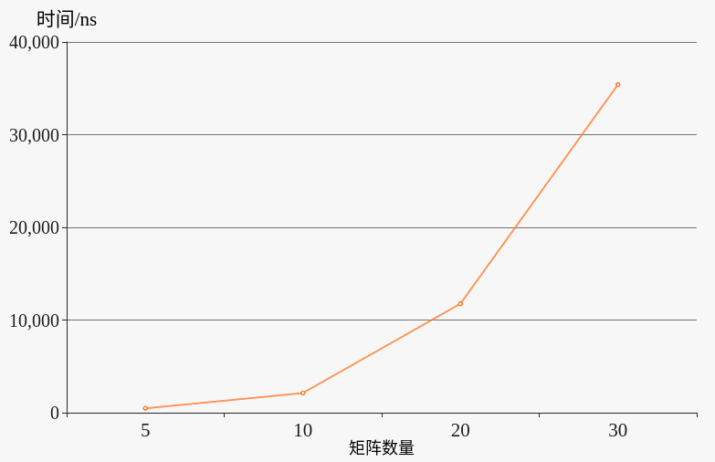
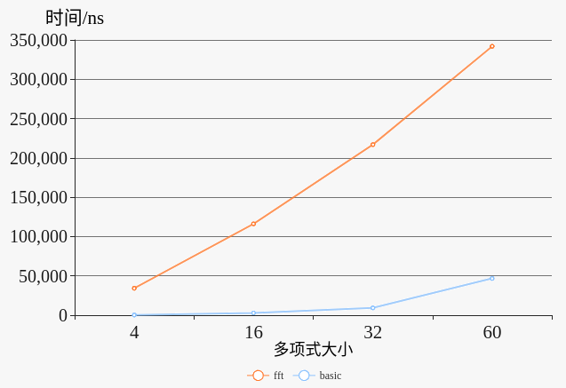

#Project 2 report

宋小牛

[TOC]

## 实验要求
* 实现求矩阵链乘问题的算法。对n的取值分别为：  5、10、20、30 ，随机生成 n+1 个整数值（ p0、p1、…、pn ）代表矩阵的规模，其中第i 个矩阵(1≤i ≤ n)的规模为pi-1 × pi ，用动态规划法求出矩阵链乘问题的最优乘法次序，统计算法运行所需时间 ，画出时间曲线。
* 2

## 实验环境

编译环境：gcc 5.4.0 on Ubuntu 16.04

CPU: Intel(R) Core(TM) i7-4710HQ, 2.50GHz

内存：8GB


## ex1

### 文件、代码结构

* `input`
  * `random.cc`: 用于生成随机矩阵链的源码
  * `input.txt`: 储存所有随机数据
* source
  * `main.cc`: 算法源码
  * `run.sh`: 编译、运行的脚本
* output
  * `result.txt`: 存有各个数量级的最优乘法方案
  * `time.txt`: 存有各个数量的时间开销

### 生成随机数据

```c++
#include <fstream>
#define num 31 // 生成不超过32的随机数
int main() {
    std::ofstream f;
    f.open("input.txt", std::ios::out);
    srand((unsigned)time(NULL));
    for (int i = 0; i < num; i++) {
        int number = rand() % 32 + 1; // 期望随机数不为0
        f << number << std::endl;
    }
    f.close();
    return 0;
}
```

### 算法代码

```c++
#include <iostream>
#include <fstream>
#include <chrono>

void print(std::ofstream &f, const int s[][number], int i = 0, int j = number - 1) {
// 根据s递归打印出矩阵乘法的分配结果
    if (i == j) {
        //矩阵下标从1开始
        f << 'A' << i + 1;
    } else {
        f << '(';
        print(f, s, i, s[i][j]);
        f << ',';
        print(f, s, s[i][j] + 1, j);
        f << ')';
    }
}
int main() {
    std::ifstream f;
    std::ofstream outf;
    std::ofstream timef;
    f.open("../input/input.txt", std::ios_base::in);
    if (number == 5) {
        // 从5开始，则清空旧的result和time
        outf.open("../output/result.txt", std::ios_base::out);
        timef.open("../output/time.txt", std::ios_base::out);
    } else {
        outf.open("../output/result.txt", std::ios_base::out | std::ios_base::app);
        timef.open("../output/time.txt", std::ios_base::out | std::ios_base::app);
    }

    //初始化
    int p[number + 1];
    int m[number][number];
    int s[number][number]; 
    //int** m = new int* [number];
    //int** s = new int* [number];
    for (int i = 0; i < number; i++) {
        //m[i] = new int [number];
        m[i][i] = 0;
        f >> p[i];
    } 
    f >> p[number];

    //开始计时
    std::chrono::system_clock::time_point start = std::chrono::system_clock::now();
    //直接将书上的伪代码转化为c代码
    for (int l = 2; l <= number; l++) {
        for (int i = 0; i <= number - l; i++) {
            int j = i + l - 1;
            m[i][j] = INT32_MAX;
            for (int k = i; k < j; k++) {
                int q = m[i][k] + m[k + 1][j] + p[i] * p[k + 1] * p[j + 1];
                if (q < m[i][j]) {
                    m[i][j] = q;
                    s[i][j] = k;
                }
            }
        }
    }

    //结束计时，计算时间
    std::chrono::system_clock::time_point end = std::chrono::system_clock::now();
    auto duration = std::chrono::duration_cast<std::chrono::microseconds>(end - start);
    auto time_cost = double(duration.count()) * std::chrono::microseconds::period::num / std::chrono::microseconds::period::den;
    timef << number << "\t: " << time_cost << std::endl;
    outf << number << "\t: ";
    print(outf, s);
    outf << std::endl;
    f.close();
    outf.close();
    timef.close();
    return 0;
}
```

### 运行脚本

```shell
g++ main.cc -std=c++11 -D number=5 -g
./a.out
g++ main.cc -std=c++11 -D number=10 -g
./a.out
g++ main.cc -std=c++11 -D number=20 -g
./a.out
g++ main.cc -std=c++11 -D number=30 -g
./a.out
```

### 运行方法

dir: `ex1/source`

```bash
$ ./run.sh
```

运行完毕后将在`output`中看到对应结果

## ex2

### 文件、代码结构

* `input`
  * `random.cc`: 用于生成随机多项式的源码
  * `input.txt`: 储存随机多项式
* source
  * `main.cc`: 具体fft乘法算法源码
  * `run.sh`: 编译、运行的脚本
* output
  * `result.txt`: 存有各个数量级的fft乘法结果
  * `time.txt`: 存有各个数量的fft乘法时间开销
  * `result_orig.txt`: 存有各个数量级的基础乘法结果
  * `time_orig.txt`: 存有各个数量级的基础乘法时间开销

### 生成随机数据

```c++
#include <iostream>
#include <fstream>
#define num 120 //生成120个数据
int main() {
    std::ofstream f;
    f.open("input.txt", std::ios::out);
    srand((unsigned)time(NULL));
    for (int i = 0; i < num; i++) {
        //欲产生(-100, 100)内的带一位小数的浮点数
        //先产生[-100, 100)内的整数
        double number = rand() % 200 - 100;
        //再加上[0, 1)内的一位小数 
        number += (rand() % 10) / 10.0;
        f << number << std::endl;
    }
    f.close();
    return 0;
}
```
### 算法代码

```c++
#include <iostream>
#include <fstream>
#include <cmath>
#include <chrono>
#define PI 3.1415926535898
//复数
typedef struct cmplx {
    double r, v;
    cmplx() {
        r = 0;
        v = 0;
    }
    cmplx(double a) {
        r = a;
        v = 0;
    }
    cmplx(double r, double v) {
        this->r = r;
        this->v = v;
    }
    cmplx(const cmplx &x) {
        this->r = x.r;
        this->v = x.v;
    }
    cmplx(cmplx &&x) {
        this->r = x.r; 
        this->v = x.v;
    }
    friend cmplx operator*(const cmplx &x, const cmplx &y) {
        cmplx r;
        r.r = x.r * y.r - x.v * y.v;
        r.v = x.r * y.v + x.v * y.r;
        return r;
    }
    friend cmplx operator+(const cmplx &x, const cmplx &y) {
        cmplx r(x.r + y.r, x.v + y.v);
        return r;
    }
    friend cmplx operator-(const cmplx &x, const cmplx &y) {
        cmplx r(x.r - y.r, x.v - y.v);
        return r;
    }
    cmplx& operator=(const cmplx &x) {
        this->r = x.r;
        this->v = x.v;
        return *this;
    }
    cmplx& operator=(cmplx &&x) {
        this->r = x.r;
        this->v = x.v;
        return *this;
    }
} cmplx;
//递归实现fft
cmplx* recursive_fft(cmplx* a, int size) {
    if (size == 1) {
        cmplx* ret = new cmplx;
        ret->r = a->r;
        ret->v = a->v;
        return ret;
    }
    cmplx wn(cos(2 * PI / size), sin(2 * PI / size)), w(1);
    cmplx* a0 = new cmplx [size / 2];
    cmplx* a1 = new cmplx [size / 2];
    int j = 0;
    for (int i = 0; i < size; i += 2) {
        a0[j] = a[i];
        a1[j] = a[i + 1];
        j++;
    }
    cmplx* y0 = recursive_fft(a0, j);
    cmplx* y1 = recursive_fft(a1, j);
    cmplx* y = new cmplx [size];
    for (int k = 0; k < j; k++) {
        y[k] = y0[k] + w * y1[k];
        y[k + j] = y0[k] - w * y1[k];
        w = w * wn;
    }
    delete [] y0;
    delete [] y1;
    delete [] a0;
    delete [] a1;
    return y;
}
//递归实现逆fft
cmplx* de_fft(cmplx* y, int size) {
    if (size == 1) {
        cmplx* ret = new cmplx;
        ret->r = y->r;
        ret->v = y->v;
        return ret;
    }
    cmplx wn(cos(-2 * PI / size), sin(-2 * PI / size)), w(1);
    cmplx* y0 = new cmplx [size / 2];
    cmplx* y1 = new cmplx [size / 2];
    int j = 0;
    for (int i = 0; i < size; i += 2) {
        y0[j] = y[i];
        y1[j] = y[i + 1];
        j++;
    }
    cmplx* a0 = de_fft(y0, j);
    cmplx* a1 = de_fft(y1, j);
    cmplx* a = new cmplx [size];
    for (int k = 0; k < j; k++) {
        a[k] = a0[k] + w * a1[k];
        a[k + j] = a0[k] - w * a1[k];
        w = w * wn;
    }
    delete [] y0;
    delete [] y1;
    delete [] a0;
    delete [] a1;
    return a;
}

int main() {
    std::ifstream inputf;
    std::ofstream outf;
    std::ofstream outf_orig;
    std::ofstream timef;
    std::ofstream timef_orig;
    inputf.open( "../input/input.txt", std::ios_base::in);
    if (number == 4) {
        outf.open("../output/result.txt", std::ios_base::out);
        timef.open("../output/time.txt", std::ios_base::out);
        outf_orig.open("../output/result_orig.txt", std::ios_base::out);
        timef_orig.open("../output/time_orig.txt", std::ios_base::out);
    } else {
        outf.open("../output/result.txt", std::ios_base::out | std::ios_base::app);
        timef.open("../output/time.txt", std::ios_base::out | std::ios_base::app);
        outf_orig.open("../output/result_orig.txt", std::ios_base::out | std::ios_base::app);
        timef_orig.open("../output/time_orig.txt", std::ios_base::out | std::ios_base::app);
    }
    //最大不超过128个输入
    cmplx a[128], b[128];
    for (int i = 0; i < number; i++) {
        inputf >> a[i].r >> b[i].r;
        a[i].v = 0;
        b[i].v = 0;
    }
    int n = 1;
    //取大于等于number的最小的2的幂，再double一次作为输入的大小
    while (n < number) n = n << 1;
    n = n << 1;
    for (int i = number; i < n; i++) {
        a[i].v = 0;
        a[i].r = 0;
        b[i].v = 0;
        b[i].r = 0;
    }

    //使用fft计算多项式乘法，开始计时
    std::chrono::system_clock::time_point start = std::chrono::system_clock::now();

    cmplx* A = recursive_fft(a, n);
    cmplx* B = recursive_fft(b, n);
    for (int i = 0; i < n; i++) {
        A[i] = A[i] * B[i];
    }
    delete [] B;
    cmplx* rst = de_fft(A, n);

    //结束计时，输出时间到文件
    std::chrono::system_clock::time_point end = std::chrono::system_clock::now();
    auto duration = std::chrono::duration_cast<std::chrono::nanoseconds>(end - start);
    auto time_cost = double(duration.count()) * std::chrono::nanoseconds::period::num;
    timef << number << "\t: " << time_cost << std::endl;

    //使用基础方法计算多项式乘法
    double orig[128] = {0};

    start = std::chrono::system_clock::now();

    for (int i = 0; i < 2 * number; i++) {
        for (int j = 0; j <= i; j++) {
            orig[i] += a[j].r * b[i - j].r;
        }
    }

    end = std::chrono::system_clock::now();
    duration = std::chrono::duration_cast<std::chrono::nanoseconds>(end - start);
    time_cost = double(duration.count()) * std::chrono::nanoseconds::period::num;
    timef_orig << number << "\t: " << time_cost << std::endl;

    //将两种方式计算的多项式乘法结果输出到output
    outf << number << "\t: (";
    outf_orig << number << "\t: (";
    for (int i = 0; i < n; i++) {
        rst[i].r = rst[i].r / n;
        rst[i].v = rst[i].v / n;
        if (i) {
            outf << ", ";
            outf_orig << ", ";
        }
        outf << rst[i].r;
        outf_orig << orig[i];
        //std::cout << "+(" << rst[i].r << '+' << rst[i].v << "i)*x^" << i;
    }
    //std::cout << std::endl;
    outf << ')' << std::endl;
    outf_orig << ')' << std::endl;
    delete [] A;
    delete [] rst;
    return 0;
}
```

### 运行脚本

```shell
g++ main.cc -std=c++11 -D number=4 -g
./a.out
g++ main.cc -std=c++11 -D number=16 -g
./a.out
g++ main.cc -std=c++11 -D number=32 -g
./a.out
g++ main.cc -std=c++11 -D number=60 -g
./a.out
```

dir: `ex2/source`

```bash
$ ./run.sh
```

运行完毕后在output中看到对应结果


使用测试数据(0, 1, 2, 3) * (0, 1, 2, 3)检验算法正确性

+(-1.42109e-14+-5.24025e-14i)*x^0+(0+-4.11778e-14i)*x^1+(1+-3.79696e-14i)*x^2+(4+-5.66554e-16i)*x^3+(10+3.81917e-14i)*x^4+(12+4.14228e-14i)*x^5+(9+5.21805e-14i)*x^6+(0+3.21625e-16i)*x^7

## 试验结果、分析

### ex1

| matrix size  |   5   |  10   |  20   |  30   |
| ------------ | ----- | ----- | ----- | ----- |
| time cost/ns |  479  | 2125  | 11753 | 35403 |



可见算法耗时基本符合$O(n^3)$的估计

### ex2

|    polynomial size     |   4   |   16   |   32   |   60   |
| ---------------------- | ----- | ------ | ------ | ------ |
|    time cost of fft    | 34278 | 116177 | 216894 | 341894 |
| time cost of basic way |  283  |  2826  |  9276  | 46757  |

 

可见算法耗时基本符合$O(nlgn)$的估计，但basic way的时间开销远小于fft，这是由输入的规模不大导致的

## 实验心得

本次实验基本将书上的伪代码转化为c代码即可，稍麻烦的是要将ex1的下标转化为从0开始，需要重理一遍算法过程