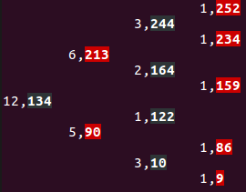
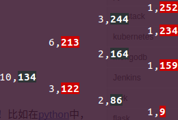
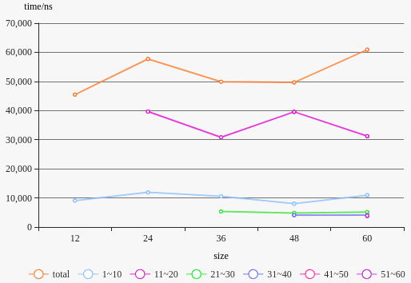
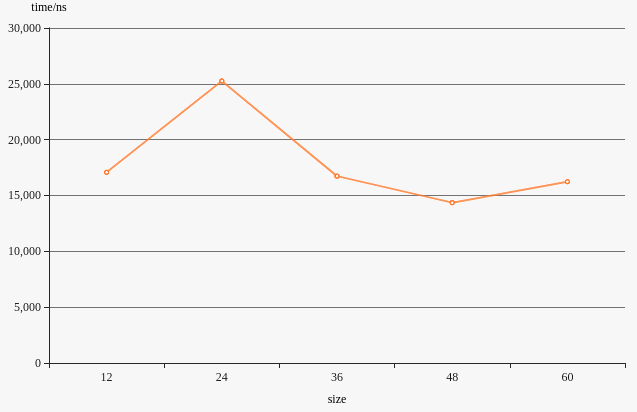

#Project 3 report

宋小牛 PB15000301

[TOC]

## 实验要求

使用三叉链表，实现一个红黑顺序统计树的插入、删除功能

## 实验环境

编译环境：gcc 5.4.0 on Ubuntu 16.04

CPU: Intel(R) Core(TM) i7-4710HQ, 2.50GHz

内存：8GB

##文件、代码结构

* `input`
  * `random.cc`: 用于生成不重复的随机key
  * `input.txt`: 储存所有随机数据
* `source`
  * `Tree.cc`: 红黑树源码
  * `select.cc`: 线性时间开销的顺序选择算法
* `output`
  * `size*`: 存有数据量为`*`的结果
    * `preorder.txt`: 先序遍历红黑树的结果
    * `inorder.txt`: 中序遍历红黑树的结果
    * `postorder.txt`: 后序遍历红黑树的结果
    * `time1.txt`: 红黑树插入操作的耗时
    * `delete_data.txt`: 从红黑树中选取$n/3$、$n/4$删除的两个值
    * `delete_data_select.txt`: 利用顺序选择算法选出来的$n/3$、$n/4$两个值
    * `time2.txt`: 删除操作的耗时

## 生成随机输入

```c++
#include <iostream>
#include <fstream>
#define num 60
int main() {
  bool array[256] = {false};
  std::ofstream f;
  f.open("input.txt", std::ios::out);
  srand((unsigned)time(NULL));
  for (int i = 0; i < num; i++) {
    int number = rand() % 256;
    //若遇到已出现过的随机数，重复生成直到出现新数为止
    while (array[number]) number = rand() % 256;
    array[number] = true;
    f << number << std::endl;
  }
  f.close();
  return 0;
}
```

## 算法代码

### 红黑树

```c++
#include <iostream>
#include <string>
#include <fstream>
#include <chrono>
//用于在Ubuntu终端输出红色与黑色
#define black_s(s) "\033[40;1m" + s + "\033[0m"
#define red_s(s) "\033[41;1m" + s + "\033[0m"
#define print_black(s) system(("echo \"\033[40;1m" + s + "\"\033[0m").c_str())
#define print_red(s) system(("echo \"\033[41;1m" + s + "\"\033[0m").c_str())
//颜色枚举类型
enum Color {black = 0, red};

template <typename V>
class RBTree { //红黑树类
private:
  //结点类型
  struct Node {
    Node *parent, *left, *right;
    //key关键字，从input中读入
    V key;
    //size记录了以本结点为根的子树的结点个数
    unsigned int size;
    Color color;
    //结构相关方法
    Node() {}
    inline Node* Parent() {return parent;}
    inline Node* Left() {return left;}
    inline Node* Right() {return right;}
    inline Node* GrandParent() {
      //由于NIL的parent还是本身，故可直接取parent而不用判断
      return parent->parent;
    }
  } *NIL, *root;
  //Node *NIL, *root;
public:
  //默认构造函数
  RBTree() {
    NIL = new Node;
    NIL->parent = NIL->left = NIL->right = NIL;
    //NIL颜色为黑
    NIL->color = black;
    NIL->size = 0;
    //root指向NIL，为空树
    root = NIL;
  }
  //销毁树
  ~RBTree() {
    Delete_RBTree(root);
    delete NIL;
  }
private:
  //销毁树中调用的递归销毁
  void Delete_RBTree(Node *p) {
    if (p == NIL) return;
    Delete_RBTree(p->left);
    Delete_RBTree(p->right);
    delete p;
  }
  inline Node* GrandParent(Node* p) {return p->parent->parent;}
  //返回叔结点
  Node* Uncle(Node* p) {
    //同样，由于NIL的各指针均指向自己，不用做是否为NIL的判断
    if (p->parent == GrandParent(p)->left) return GrandParent(p)->right;
    return GrandParent(p)->left;
  }
  //返回兄弟结点
  Node* Brother(Node* p) {
    if (p == p->parent->left) return p->parent->right;
    return p->parent->left;
  }
  //左旋，调用处保证p非NIL
  void Left_Rotate(Node* p) {
    //先处理size域
    p->right->size = p->size;
    p->size -= p->right->right->size + 1;
    //共6个指针要处理，注意判断p为root要修改root
    if (p == root) {
      root = p->right;
    } else if (p->parent->left == p) {
      p->parent->left = p->right;
    } else {
      p->parent->right = p->right;
    }
    p->right->parent = p->parent;
    p->parent = p->right;
    p->right = p->right->left;
    p->right->parent = p;
    p->parent->left = p;
  }
  //右旋，与左旋类似
  void Right_Rotate(Node* p) {
    p->left->size = p->size;
    p->size -= p->left->left->size + 1;
    if (p == root) {
      root = p->left;
    } else if (p->parent->left == p) {
      p->parent->left = p->left;
    } else {
      p->parent->right = p->left;
    }
    p->left->parent = p->parent;
    p->parent = p->left;
    p->left = p->left->right;
    p->left->parent = p;
    p->parent->right = p;
  }
public:
  //插入一个key
  void insert(const V &key) {
    Node* p = new Node;
    p->key = key;
    Node **x, *q;
    q = NIL;
    x = &root;
    //下降到NIL处，沿途的size增加1
    while (*x != NIL) {
      q = *x;
      (*x)->size++;
      if ((*x)->key > key) {
        x = &((*x)->left);
      } else {
        x = &((*x)->right);
      }
    }
    *x = p;
    p->parent = q;
    p->left = NIL;
    p->right = NIL;
    //插入结点设为红
    p->color = red;
    p->size = 1;
    //插入后fix红黑性质
    insert_fix(p);
  }
private:
  //修正插入颜色
  void insert_fix(Node* z) {
    //书上代码结构不是很清晰
    //case1需要递归（或循环）往根进行fix，而case2 3不用
    //这里增加了break与continue
    while (z->parent->color == red) {
      Node* y = Uncle(z);
      // case 1
      if (y->color == red) {
        //叔为红色，父为红色
        z->parent->color = black;
        y->color = black;
        z->parent->parent->color = red;
        z = z->parent->parent;
        //fix z的祖父
        continue;
      }
      // case 2
      // 叔为黑，父为红
      // 将z置于其父相对祖父一样的位置，转为case 3
      if (z == z->parent->right && z->parent == GrandParent(z)->left) {
        Left_Rotate(z->parent);
        z = z->left;
      } else if (z == z->parent->left && z->parent == GrandParent(z)->right) {
        Right_Rotate(z->parent);
        z = z->right;
      }
      // case 3
      // 对祖父进行旋转操作
      z->parent->color = black;
      GrandParent(z)->color = red;
      if (z == z->parent->left) {
        Right_Rotate(GrandParent(z));
      } else {
        Left_Rotate(GrandParent(z));
      }
      //case 2 3可直接结束
      break;
    }
    //root可能被改变颜色，设为黑
    root->color = black;
  }
public:
  //打印所有结点的size、key、颜色
  void print() {
    print(root, 0);
    system("echo");
  }
private:
  //打印所有结点调用的递归函数
  //按深度中序打印树
  void print(Node* p, int depth) {
    if (p == NIL) return;
    print(p->right, depth + 1);
    std::string s;
    for (int i = 0; i < depth; i++) {
      s += "\t";
    }
    if (p->color == black) {
      system(("echo \"" + s + std::to_string(p->size) + "," + black_s(std::to_string(p->key)) + "\"").c_str());
    } else {
      system(("echo \"" + s + std::to_string(p->size) + "," + red_s(std::to_string(p->key)) + "\"").c_str());
    }
    print(p->left, depth + 1);
  }
public:
  //向文件中输出树的先序遍历
  void preorder() {
    std::fstream f;
    f.open("../output/size" + std::to_string(number) + "/preorder.txt", std::ios_base::out);
    preorder(root, f);
    f.close();
  }
  //向文件中输出树的中序遍历
  void inorder() {
    std::fstream f;
    f.open("../output/size" + std::to_string(number) + "/inorder.txt", std::ios_base::out);
    inorder(root, f);
    f.close();
  }
  //向文件中输出树的后序遍历
  void postorder() {
    std::fstream f;
    f.open("../output/size" + std::to_string(number) + "/postorder.txt", std::ios_base::out);
    postorder(root, f);
    f.close();
  }
private:
  //递归输出先序
  void preorder(Node* p, std::fstream &f) {
    if (p == NIL) return;
    f << p->key << ", ";
    preorder(p->left, f);
    preorder(p->right, f);
  }
  //中序
  void inorder(Node* p, std::fstream &f) {
    if (p == NIL) return;
    inorder(p->left, f);
    f << p->key << ", ";
    inorder(p->right, f);
  }
  //后序
  void postorder(Node* p, std::fstream &f) {
    if (p == NIL) return;
    postorder(p->left, f);
    postorder(p->right, f);
    f << p->key << ", ";
  }
  //将子树v拼接到u的位置，这里不处理size域
  void transplant(Node* u, Node* v) {
    if (u == root) {
      root = v;
    } else if (u == u->parent->left) {
      u->parent->left = v;
    } else {
      u->parent->right = v;
    }
    v->parent = u->parent;
  }
public:
  //删除结点z
  void delete_node(Node* z) {
    //无法删除NIL
    if (z == NIL) return;
    //调用处保证z为树中存在的结点
    Node* y = z;
    Node* x = root;
    //下降到z的位置，路上的size - 1
    while (x != z) {
      x->size--;
      if (x->key < z->key) {
        x = x->right;
      } else {
        x = x->left;
      }
    }
    Color y_orig_color = y->color;
    //z最多一个子节点，相当于删除z，将z的子节点移到z原本的位置
    if (z->left == NIL) {
      x = z->right;
      transplant(z, x);
    } else if (z->right == NIL) {
      x = z->left;
      transplant(z, x);
    } else {
      //z有两个子节点，相当于将z与z的后继y的key值交换，然后删除y结点，这时候判断颜色应为y的颜色
      y = z->right;
      //找到z的后继，由于要将y从中抽离，z的右子树中y的祖先的size - 1
      while (y->left != NIL) {y->size--; y = y->left;}
      //记录后继y的颜色
      y_orig_color = y->color;
      x = y->right;
      //若z非y的父节点，将y的右孩子x拼接到y的位置，将z的右子树移到z的右子树
      if (y->parent != z) {
        transplant(y, y->right);
        y->right = z->right;
        y->right->parent = y;
      }
      //将y替换到z的位置，并将z的左子树拼接到y的左子树
      transplant(z, y);
      y->left = z->left;
      y->left->parent = y;
      y->color = z->color;
      //y处在z的位置，其size - 1
      y->size = z->size - 1;
    }
    //被删掉的结点为黑，需要fix红黑性质
    if (y_orig_color == black) {
      delete_fix_up(x);
    }
  }
private:
  void delete_fix_up(Node* x) {
    while (x != root && x->color != black) {
      if (x == x->parent->left) {
        Node* w = x->parent->right;
        if (w->color == red) {//case1,转为2或3或4
          w->color = black;
          x->parent->color = red;
          Left_Rotate(x->parent);
          w = x->parent->right;
        }
        if (w->left->color == black && w->right->color == black) {//case2
          w->color = red;
          x = x->parent;
        } else {
          if (w->right->color == black) {
            //case3 转为case4
            w->left->color == black;
            w->color = red;
            Right_Rotate(w);
            w = x->parent->right;
          }
          //case4
          w->color = x->parent->color;
          x->parent->color = black;
          w->right->color = black;
          Left_Rotate(x->parent);
          x = root;
        }
      } else {
        //对称情况
        Node* w = x->parent->left;
        if (w->color == red) {
          w->color = black;
          x->parent->color = red;
          Right_Rotate(x->parent);
          w = x->parent->left;
        }
        if (w->right->color == black && w->left->color == black) {
          w->color = red;
          x = x->parent;
        } else {
          if (w->left->color == black) {
            w->right->color == black;
            w->color = red;
            Left_Rotate(w);
            w = x->parent->left;
          }
          w->color = x->parent->color;
          x->parent->color = black;
          w->left->color = black;
          Right_Rotate(x->parent);
          x = root;
        }
      }
    }
    x->color = black;
  }
  Node* locate_key(Node* p, const V &key) {
    //递归找到值为key的结点
    if (p == NIL) return p;
    if (key == p->key) {
      return p;
    }
    if (key < p->key) {
      return locate_key(p->left, key);
    }
    return locate_key(p->right, key);
  }
  Node* locate_order(Node* p, int i) {
    //递归找到顺序为i的结点
    if (p->left->size == i - 1) {
      return p;
    }
    if (p->left->size > i - 1) {
      return locate_order(p->left, i);
    }
    return locate_order(p->right, i - p->left->size - 1);
  }
  V find_order(Node* p, int i) {
    //递归找到顺序为i的值
    if (p->left->size == i - 1) {
      return p->key;
    }
    if (p->left->size > i - 1) {
      return find_order(p->left, i);
    }
    return find_order(p->right, i - p->left->size - 1);
  }
public:
  //供外层使用的寻找值为key的结点的方法
  Node* locate_key(const V &key) {
    return locate_key(root, key);
  }
  //供外层使用的寻找第i个结点的方法
  Node* locate_order(int i) {
    if (i > root->size) return NIL;
    return locate_order(root, i);
  }
  //供外层使用的寻找第i各结点的值的方法
  V find_order(int i) {
    if (i > root->size) {
      std::cerr << "size over match\n";
      return 0;
    }
    return find_order(root, i);
  }
};
int main() {
  RBTree<int> T;
  int key;
  std::fstream f, time, delete_data;
  //打开输入数据、计时文件、删除数据文件
  f.open("../input/input.txt", std::ios_base::in);
  time.open("../output/size" + std::to_string(number) +"/time1.txt", std::ios_base::out);
  delete_data.open("../output/size" + std::to_string(number) + "/delete_data.txt", std::ios_base::out);
  
  //开始计时
  std::chrono::system_clock::time_point start = std::chrono::system_clock::now();
  std::chrono::system_clock::time_point s1 = start;
  for (int i = 0; i < number; i++) {
    //插入number个数据
    f >> key;
    T.insert(key);
    //第10的倍数个时输出时间
    if (i % 10 == 9) {
      auto s2 = std::chrono::system_clock::now();
      auto d = std::chrono::duration_cast<std::chrono::nanoseconds>(s2 - s1);
      time << i + 1 << ": " << double(d.count()) * std::chrono::nanoseconds::period::num << std::endl;
      s1 = s2;
    }
  }
  //输出总时间
  std::chrono::system_clock::time_point end = std::chrono::system_clock::now();
  auto duration = std::chrono::duration_cast<std::chrono::nanoseconds>(end - start);
  time << "total: " << double(duration.count()) * std::chrono::nanoseconds::period::num;
  //在终端打印带颜色的红黑树，并输出前中后序到文件
  T.print();
  T.inorder();
  T.preorder();
  T.postorder();
  //删除计时
  start = std::chrono::system_clock::now();
  //输出被删除的数据
  delete_data << "Tree[number / 3] = Tree[" << number << " / 3] = Tree[" << number / 3 << "] = " << T.find_order(number / 3) << std::endl;
  //删除结点
  T.delete_node(T.locate_order(number / 3));
  //T.print();
  //删除下一个结点，number-1
  delete_data << "Tree[number / 4] = Tree[" << number - 1 << " / 4] = Tree[" << (number - 1) / 4 << "] = " << T.find_order((number - 1) / 4) << std::endl;
  T.delete_node(T.locate_order((number - 1) / 4));
  end = std::chrono::system_clock::now();
  duration = std::chrono::duration_cast<std::chrono::nanoseconds>(end - start);
  time.close();
  time.open("../output/size" + std::to_string(number) + "/time2.txt", std::ios_base::out);
  //输出删除时间到文件
  time << "delete time: " << double(duration.count()) * std::chrono::nanoseconds::period::num;
  //输出删除之后的树
  T.print();
  f.close();
  time.close();
  return 0;
}
```

### 选择算法

```c++
#include <iostream>
#include <fstream>
#include <array>
template <typename V>
int random_partition(V* A, int p, int r) {
    srand((unsigned)time(NULL));
    int i = rand() % (r - p);
    V tmp = A[p + i];
    A[p + i] = A[r];
    A[r] = tmp;
    i = p - 1;
    V t;
    for (int j = p; j < r; j++) {
        if (A[j] <= tmp) {
            i++;
            t = A[i];
            A[i] = A[j];
            A[j] = t;
        }
    }
    tmp = A[i + 1];
    A[i + 1] = A[r];
    A[r] = tmp;
    return i + 1;
}
template<typename V>
V random_select(V* A, int p, int r, int i) {
    if (p == r) {
        return A[p];
    }
    int q = random_partition(A, p, r);
    int k = q - p + 1;
    if (i == k) {
        return A[q];
    } else if (i < k) {
        return random_select(A, p, q - 1, i);
    } else {
        return random_select(A, q + 1, r, i - k);
    }
}
int main() {
    int A[number];
    std::fstream f, delete_data;
    f.open("../input/input.txt", std::ios_base::in);
    delete_data.open("../output/size" + std::to_string(number) + "/delete_data_select.txt", std::ios_base::out);
    for (int i = 0; i < number; i++) {
        f >> A[i];
    }
    delete_data << "A[number / 3] = A[" << number << " / 3] = A[" << number / 3 << "] = " << random_select(A, 0, number - 1, number / 3) << std::endl;
    A[number / 3] = INT32_MAX;
    delete_data << "set number / 3 to INT32_MAX, so when search for i-th small value, it acts like the number has been deleted\n";
    delete_data << "A[number / 4] = A[" << number - 1 << " / 4] = A[" << (number - 1) / 4 << "] = " << random_select(A, 0, number - 1, (number - 1) / 4) << std::endl;
    f.close();
}
```

## 运行脚本

使用GNU make运行

```makefile
blackred12:
	g++ -std=c++11 Tree.cc -Dnumber=12
	./a.out
blackred24:
	g++ -std=c++11 Tree.cc -Dnumber=24
	./a.out
blackred36:
	g++ -std=c++11 Tree.cc -Dnumber=36
	./a.out
blackred48:
	g++ -std=c++11 Tree.cc -Dnumber=48
	./a.out
blackred60:
	g++ -std=c++11 Tree.cc -Dnumber=60
	./a.out
select12:
	g++ -std=c++11 select.cc -Dnumber=12
	./a.out
select24:
	g++ -std=c++11 select.cc -Dnumber=24
	./a.out
select36:
	g++ -std=c++11 select.cc -Dnumber=36
	./a.out
select48:
	g++ -std=c++11 select.cc -Dnumber=48
	./a.out
select60:
	g++ -std=c++11 select.cc -Dnumber=60
	./a.out
runall:
#一次性运行所有大小
	for k in 12 24 36 48 60; do \
		g++ -std=c++11 Tree.cc -Dnumber=$$k; \
		./a.out; \
		g++ -std=c++11 select.cc -Dnumber=$$k; \
		./a.out; \
	done
random:
#生成随机数
	g++ -std=c++11 ../input/random.cc -o ../input/a.out
	../input/a.out
	mv input.txt ../input/input.txt
```

## 运行方法

```shell
/Project3/ex1/source$ make random
/Project3/ex1/source$ make runall
```

## 实验结果分析

以12为例，输入序列为`134 244 122 164 213 90 9 252 234 159 10 86`

生成的红黑树：



删去的结点为：第12/3=4个为90、第11/4=2个为10

删除后树为


插入时间/ns

| size  | 12    | 24    | 36    | 48    | 60    |
| ----- | ----- | ----- | ----- | ----- | ----- |
| total | 45476 | 57716 | 49884 | 49670 | 60908 |
| 1~10  | 9086  | 11916 | 10552 | 8012  | 10942 |
| 11~20 |       | 39650 | 30819 | 29553 | 31213 |
| 21~30 |       |       | 5347  | 4838  | 5136  |
| 31~40 |       |       |       | 4074  | 4097  |
| 41~50 |       |       |       |       | 3768  |
| 51~60 |       |       |       |       | 3936  |



可以看出，各时间与树大小并无明显的递增关系，其原因归咎于执行过程中较频繁的I/O操作以及过小的数据量

删除时间/ns

| size | 12    | 24    | 36    | 48    | 60    |
| ---- | ----- | ----- | ----- | ----- | ----- |
| time | 17075 | 25253 | 16735 | 14360 | 16234 |



可以看出，各时间与树大小并无明显的递增关系，其原因归咎于执行过程中的I/O操作以及过小的数据量

## 总结

本次实验数据量过小，数据未能很好的体现红黑树的算法优势