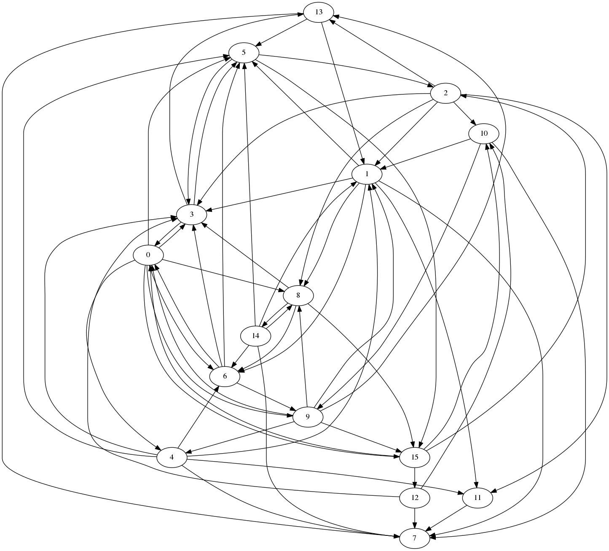
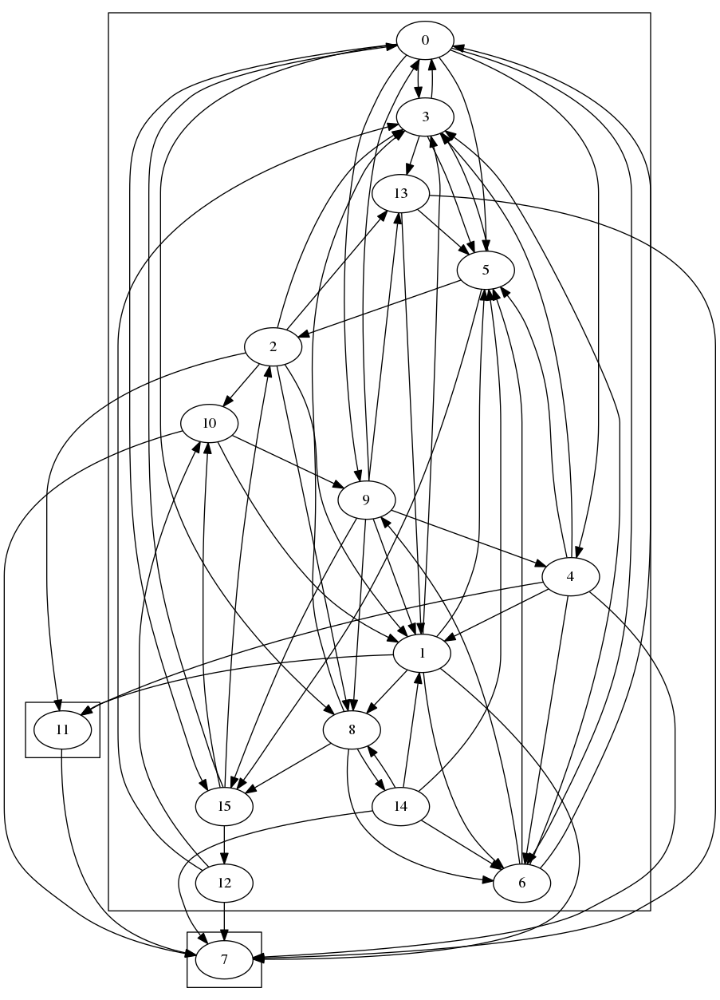
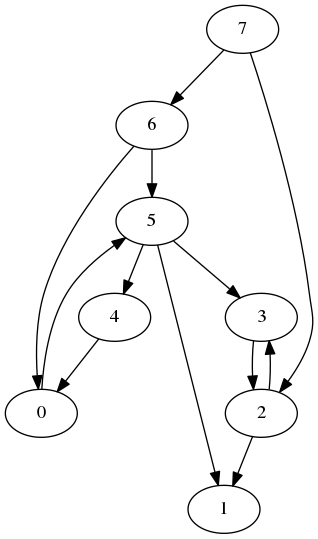
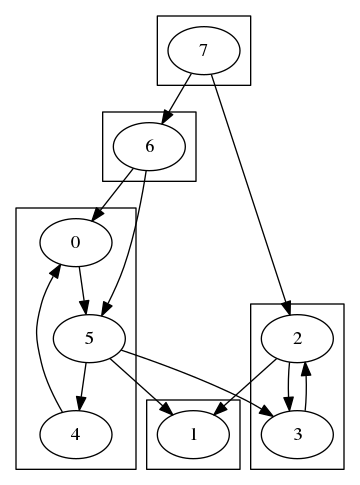
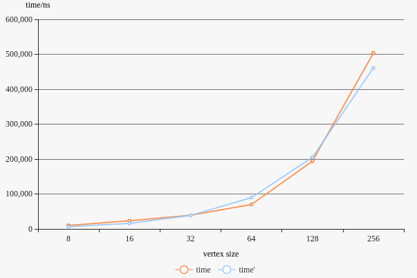
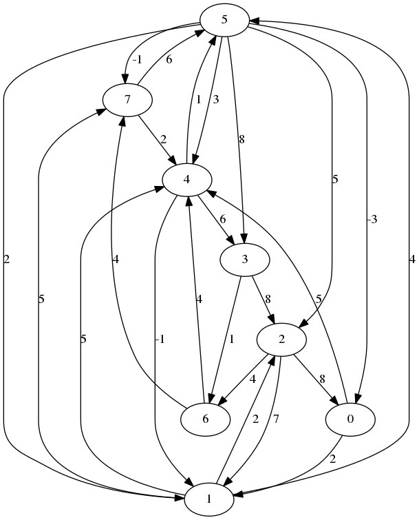
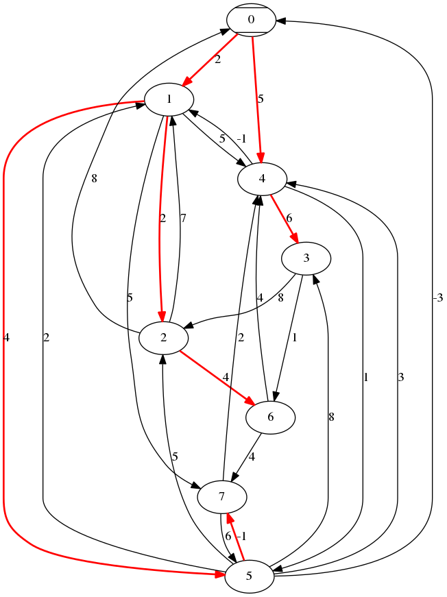
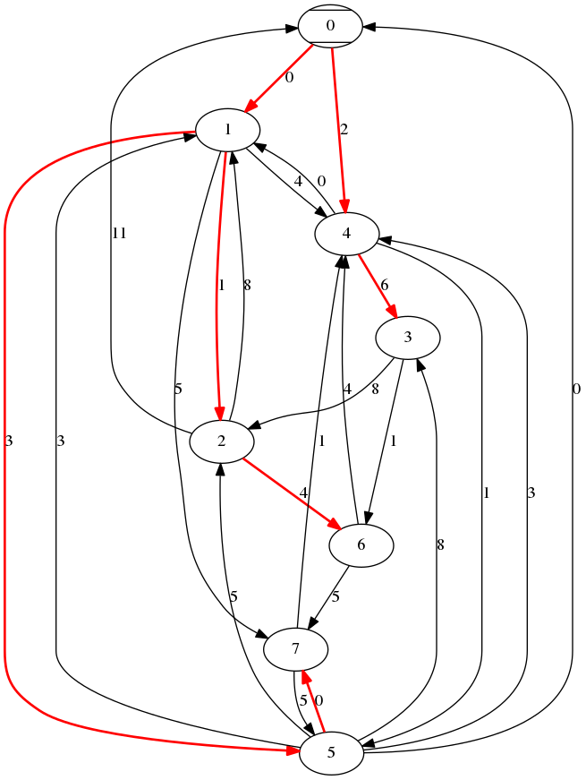
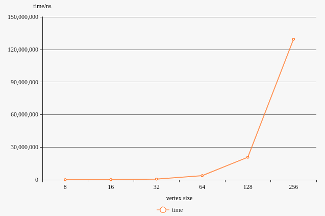

# Project 3 report

宋小牛 PB15000301

[TOC]

## 实验要求

## 实验环境

编译环境：gcc 5.4.0 on Ubuntu 16.04

CPU: Intel(R) Core(TM) i7-4710HQ, 2.50GHz

内存：8GB

配套软件：graphviz, GNU make

## 文件、代码结构

* `project1`
  * `input`
    * `size*`：不同size的随机图输入
      * `input.txt`：随机图数据，每行一个结点对，尾指向头
    * `Makefile`：编译、生成各个size的数据
    * `random.cc`：生成随机图的源码
  * `output`
    * `size*`：不同size的结果输出
      * `output1.txt`：强联通分量的括号
      * `g.gv`：原图的有向图代码，供graphviz使用
      * `sub.gv`：将强联通分量建为子图的代码，供graphviz使用
      * `g.png`：graphviz导出的原图图片
      * `sub.png`：graphviz导出的带子图的图片
    * `Makefile`：用于一键生成图片
  * `source`
    * `main.cc`：计算强联通分量的源码
    * `Makefile`：编译、运行各个size计算强联通分量
  * `Makefile`：在project1进行生成输入、计算子图、生成图片

## 代码注释

### project1 强联通分量

#### 生成随机图

```c++
#include <iostream>
#include <fstream>
#include <array>
#include <string>
// in_size 由编译指令指定
// vertex_size为编译时确定的常量，从而可直接用于数组长度
#define vertex_size (1 << (in_size + 2))
int main() {
    // 储存边的二维数组
    std::array<std::array<bool, vertex_size>, vertex_size> edges = { {false} };
    std::ofstream f;
    f.open("size" + std::to_string(in_size) + "/input.txt", std::ios::out);
    srand((unsigned)time(NULL));
    // edge_size = vertex_size * log(vertex_size)
    int edge_size = vertex_size * (in_size + 2);
    for (int i = 0; i < edge_size; i++) {
        // 随机选取两个顶
        int a = rand() % vertex_size;
        int b = rand() % vertex_size;
        // 两顶已相连，重新生成一对
        while (a == b || edges[a][b] == true) {
            a = rand() % vertex_size;
            b = rand() % vertex_size;
        }
        // 有向图，故只置一个方向为true
        edges[a][b] = true;
        f << a << ' ' << b << std::endl;
    }
    f.close();
    return 0;
}
```

#### 算法代码
```c++
#include <iostream>
#include <fstream>
#include <array>
#include <string>
#include <vector>
#include <set>
#define vertex_size (1 << (in_size + 2))
// finish_time有上限，用于进行计数排序
#define max_finish_time ((vertex_size << 1) + 1)
// 颜色类型
enum Color_e {WHITE = 0, GRAY, BLACK};
// 图为一个bool类型的二维数组
typedef bool Graph[vertex_size][vertex_size];
// 开始时间、结束时间为一个无符号整数数组
typedef std::array<unsigned int, vertex_size> Time;
// 结点颜色类型
typedef Color_e Color[vertex_size];
// 结点列表类型
typedef int Node_List[vertex_size];
// 使用整数代表一个结点
typedef int Vertex;
// 第一遍深度优先遍历调用的递归函数，需使用color、完成时间
void DFS_visit(Graph &G, Vertex u, int& time, Time& finish_time, Color& colors) {
    time++;
    // 不使用故不储存开始时间
    colors[u] = GRAY;
    for (Vertex v = 0; v < vertex_size; v++) {
        if (G[u][v]) {
            if (colors[v] == WHITE) {
                DFS_visit(G, v, time, finish_time, colors);
            }
        }
    }
    colors[u] = BLACK;
    time++;
    finish_time[u] = time;
}
// 第一遍深度优先遍历
Time DFS_finish(Graph &G) {
    Color colors;
    Time finish_time;
    for (int i = 0; i < vertex_size; i++) {
        colors[i] = WHITE;
        finish_time[i] = 0;
    }
    int time = 0;
    for (Vertex u = 0; u < vertex_size; u++) {
        if (colors[u] == WHITE) {
            DFS_visit(G, u, time, finish_time, colors);
        }
    }
    // 返回完成时间给上层使用
    return finish_time;
}
// 第二遍深度优先遍历调用的递归函数，仅使用color， 同时将同一子树的结点放入一个集合中
void DFS_visit(Graph &G, Vertex u, Color& colors, std::set<Vertex>& block) {
    colors[u] = GRAY;
    for (Vertex v = 0; v < vertex_size; v++) {
        if (G[u][v]) {
            if (colors[v] == WHITE) {
                block.insert(v);
                DFS_visit(G, v, colors, block);
            }
        }
    }
    colors[u] = BLACK;
}
// 第二遍深度优先遍历，按照完成时间降序来遍历图结点
// list中为按照finish_time排好序的每个结点序号
std::vector<std::set<Vertex>> DFS(Graph& G, Node_List& list) {
    Color colors;
    // 储存子图集合
    std::vector<std::set<Vertex>> blocks;
    for (int i = 0; i < vertex_size; i++) {
        colors[i] = WHITE;
    }
    for (int i = 0; i < vertex_size; i++) {
        Vertex u = list[i];
        if (colors[u] == WHITE) {
            // 结点u未被遍历，为其创建一个子图
            std::set<Vertex> block;
            block.insert(u);
            DFS_visit(G, u, colors, block);
            blocks.push_back(block);
        }
    }
    return blocks;
}
int main() {
    Graph G = {{false}};
    std::fstream input, print, output, time;
    input.open("../input/size" + std::to_string(in_size) + "/input.txt", std::ios_base::in);
    print.open("../output/size" + std::to_string(in_size) + "/g.gv", std::ios_base::out);
    time.open("../output/size" + std::to_string(in_size) + "/time1.txt", std::ios_base::out);
    print << "digraph G {\n";
    Vertex u, v;
    // 从输入建立图
    while (input >> u >> v) {
        G[u][v] = true;
        // 输出有向图信息到gv文件
        print << "    " << std::to_string(u) << " -> " << std::to_string(v) << ";\n";
    }
    print << '}';
    print.close();
    //std::array<, vertex_size> f, d;
    Graph GT;
    // 计算图G的转置
    for (int i = 0; i < vertex_size; i++) {
        for (int j = 0; j < vertex_size; j++) {
            GT[i][j] = G[j][i];
        }
    }
    // 初始化finish_time
    unsigned int C[max_finish_time] = {0};
    // 开始计时
    auto start = std::chrono::system_clock::now();
    // 第一遍深度优先遍历，储存完成时间到f
    Time f = std::move(DFS_finish(G));
    // 使用计数排序给完成时间降序排序
    Node_List nodes_by_decrease_f;
    for (Vertex u = 0; u < vertex_size; u++) {
        C[f[u]]++;
    }
    for (int i = max_finish_time - 2; i >= 0; i--) {
        C[i] += C[i + 1];
    }
    for (Vertex u = 0; u < vertex_size; u++) {
        nodes_by_decrease_f[C[f[u]] - 1] = u;
        // 2 vertexs' finish_time can't be the same
    }
    // 第二遍深度优先遍历，保存一个集合vector，每个集合为一个强联通分量
    std::vector<std::set<Vertex>> blocks(std::move(DFS(GT, nodes_by_decrease_f)));
    // 停止计时
    auto end = std::chrono::system_clock::now();
    auto duration = std::chrono::duration_cast<std::chrono::nanoseconds>(end - start);
    time << "total: " << double(duration.count()) * std::chrono::nanoseconds::period::num;
    // 输出强联通分量到文件
    output.open("../output/size" + std::to_string(in_size) + "/output1.txt", std::ios_base::out);
    print.open("../output/size" + std::to_string(in_size) + "/sub.gv", std::ios_base::out);
    print << "digraph G {" << std::endl;
    int i = 0;
    // 导出output文件以及每个子图的内边
    for (auto& block : blocks) {
        output << '(';
        print << "    subgraph cluster" << i << " {" << std::endl;
        for (Vertex u : block) {
            output << u << "  ";
            // 每个结点要单独输出到子图里，否则仅含一个结点的子图因为无边而显式为空子图
            print << "        " << u << ";" << std::endl;
            for (Vertex v : block) {
                if (G[u][v]) {
                    print << "        " << u << " -> " << v << ";" << std::endl;
                }
            }
        }
        print << "    }" << std::endl;
        i++;
        output << ")  ";
    }
    i = 0;
    // 导出子图间的边
    for (auto& block_u : blocks) {
        i++;
        int j = 0;
        for (auto& block_v : blocks) {
            j++;
            if (i == j) {
                continue;
            }
            for (Vertex u : block_u) {
                for (Vertex v : block_v) {
                    if (G[u][v]) {
                        print << "    " << u << " -> " << v << ";" << std::endl;
                    }
                }
            }
        }
    }
    print << "}";
    output.close();
    print.close();
    time.close();
}
```

### project2 Johnson算法

#### 生成随机图

```c++
#include <iostream>
#include <fstream>
#include <array>
#include <string>
// in_size 由编译指令指定
// vertex_size为编译时确定的常量，从而可直接用于数组长度
#define vertex_size (1 << (in_size + 2))
int main() {
    // 储存边是否存在的标志数组
    bool connected[vertex_size][vertex_size] = {{false}};
    // 储存边权值的数组
    int edges[vertex_size][vertex_size];
    std::ofstream f;
    f.open("size" + std::to_string(in_size) + "/input.txt", std::ios::out);
    srand((unsigned)time(NULL));
    int log_vertex_size = in_size + 2;
    int edge_size = vertex_size * log_vertex_size;
    // 生成 log(V) 个负权值的边
    for (int i = 0; i < log_vertex_size; i++) {
        int a = rand() % vertex_size;
        int b = rand() % vertex_size;
        while (a == b || connected[a][b] == true) {
            a = rand() % vertex_size;
            b = rand() % vertex_size;
        }
        connected[a][b] = true;
        // 权值范围为 -1 ~ -log(V)
        edges[a][b] = rand() % log_vertex_size - log_vertex_size;
        f << a << ' ' << b << ' ' << edges[a][b] << std::endl;
    }
    // 生成 (V-1)log(V) 个负权值的边
    for (int i = log_vertex_size; i < edge_size; i++) {
        int a = rand() % vertex_size;
        int b = rand() % vertex_size;
        while (a == b || connected[a][b] == true) {
            a = rand() % vertex_size;
            b = rand() % vertex_size;
        }
        // 有向图，只置一个方向为true
        connected[a][b] = true;
        // 权值范围为 1 ~ V
        edges[a][b] = rand() % vertex_size + 1;
        f << a << ' ' << b << ' ' << edges[a][b] << std::endl;
    }
    f.close();
    return 0;
}
```
#### 算法代码

```c++
#include <iostream>
#include <fstream>
#include <array>
#include <string>
#include <vector>
#include <set>
#include <chrono>
// 顶数
#define vertex_size (1 << (in_size + 2))
// 增加新顶后的顶数
#define vertex_size_1 ((1 << (in_size + 2)) + 1)
// 两种图类型
typedef int Graph[vertex_size][vertex_size];
typedef int Graph_1[vertex_size_1][vertex_size_1];
typedef int Node_List[vertex_size];
typedef int Node_List_1[vertex_size_1];
typedef int Vertex;

// BF算法，输入图顶数为原图大小+1
bool bellman_ford(Graph_1 G, Vertex s, Node_List_1& d) {
    for (int i = 0; i < vertex_size_1; i++) {
        d[i] = INT32_MAX;
    }
    d[s] = 0;
    for (int i = 1; i < vertex_size_1; i++) {
        // 每一轮对每边进行松弛
        for (Vertex u = 0; u < vertex_size_1; u++) {
            for (Vertex v = 0; v < vertex_size_1; v++) {
                if (G[u][v] == INT32_MAX) continue;
                if (d[u] == INT32_MAX) continue;
                if (d[v] > d[u] + G[u][v]) {
                    d[v] = d[u] + G[u][v];
                }
            }
        }
    }
    // 对每边判断是否还能继续松弛
    for (Vertex u = 0; u < vertex_size_1; u++) {
        for (Vertex v = 0; v < vertex_size_1; v++) {
            if (G[u][v] == INT32_MAX) continue;
            if (d[u] == INT32_MAX) continue;
            if (d[u] != INT32_MAX && v[d] == INT32_MAX || d[u] + G[u][v] < d[v]) return false;
        }
    }
    return true;
}

// 用于dijkstra的二叉堆，每个结点的key值d以数组的形式存于堆中
class Heap {
public:
    // 从s开始的dijkstra， d置为0
    Heap(Vertex s) {
        for (int i = 0; i < vertex_size; i++) {
            d[i] = INT32_MAX;
            Vertexs[i] = i;
            index[i] = i;
        }
        d[s] = 0;
        // s为最小元素，放到开头，其余元素均相同，故此时已是一个最小堆
        Vertexs[0] = s;
        Vertexs[s] = 0;
        index[s] = 0;
        index[0] = s;
        size = vertex_size;
    }
    inline Vertex parent (Vertex u) {
        return (u - 1) >> 1;
    }
    inline Vertex left (Vertex u) {
        return (u << 1) + 1;
    }
    inline Vertex right (Vertex u) {
        return (u + 1) << 1;
    }
    // 维护该结点对应子树的最小堆性质
    void min_heapify(Vertex i) {
        int max_parent = (size >> 1) - 1;
        // 当i是一个内部结点
        while (i <= max_parent) {
            // 此时i必有左孩子
            int min = i;
            // 找到i left(i) right(i) 中d最小
            if (d[Vertexs[min]] > d[Vertexs[left(i)]]) {
                min = left(i);
            }
            // right可能不存在
            if (right(i) < size && d[Vertexs[min]] > d[Vertexs[right(i)]]) {
                min = right(i);
            }
            if (min == i) break;
            // 交换min和i的位置
            Vertex t = Vertexs[min];
            Vertexs[min] = Vertexs[i];
            Vertexs[i] = t;
            // 更新index
            index[t] = i;
            index[Vertexs[min]] = min;
            i = min;
        }
    }
    Vertex extract_min() {
        size--;
        // 与最后一个元素交换位置
        Vertex t = Vertexs[size];
        Vertexs[size] = Vertexs[0];
        Vertexs[0] = t;
        index[t] = 0;
        index[Vertexs[size]] = size;
        // 维护性质
        min_heapify(0);
        return Vertexs[size];
    }
    void decrease(Vertex u, int k) {
        // 这里传入的是结点，不是Vertexs中的偏移
        d[u] = k;
        int i = index[u];
        // 迭代上移直到不影响堆性质
        while (i > 0 && d[Vertexs[parent(i)]] > d[u]) {
            int t = Vertexs[parent(i)];
            Vertexs[parent(i)] = u;
            Vertexs[index[u]] = t;
            index[t] = index[u];
            index[u] = parent(i);
            i = index[u];
        }
    }
    // Vertexs：储存堆的数组，每一个元素为结点
    Node_List Vertexs;
    // d：储存每个结点与开始结点的距离上界
    Node_List d;
    // index：每个结点对应Vertexs中的哪一个偏移，用于快速索引
    // a vertex u, Vertex[i] = u, d[u] = u.d
    // index[Vertexs[i]] = i
    // Vertexs[index[u]] = u
    Node_List index;
    int size;
};

// dijkstra算法，维护一个传入的储存先驱的数组
bool dijkstra(Graph G, Vertex s, Node_List& precursor) {
    bool S[vertex_size] = {false};
    Heap H(s);
    while (H.size > 0) {
        Vertex u = H.extract_min();
        S[u] = true;
        // u的d为正无穷，说明s到u不可达，不联通
        if (H.d[u] == INT32_MAX) {
            return false;
        }
        for (Vertex v = 0; v < vertex_size; v++) {
            // v已找到最短路径，或uv不相邻，不松弛
            if (S[v]) continue;
            if (G[u][v] == INT32_MAX) continue;
            if (H.d[v] > H.d[u] + G[u][v]) {
                H.decrease(v, H.d[u] + G[u][v]);
                precursor[v] = u;
            }
        }
    }
    // 置开始结点的先驱，用于在递归生成路径中判断
    precursor[s] = s;
    return true;
}

std::string recursive_path(Vertex u, Vertex s, Node_List &precursor, int &distance, Graph_1 &G) {
    // 储存路径字符串、长度
    // 带备忘的递归
    static std::string str[vertex_size][vertex_size];
    static int distances[vertex_size][vertex_size];
    if (str[s][u].size() == 0) {

        if (u == precursor[u]) {
            // 路径开头
            str[s][u] = std::to_string(u);
            distances[s][u] = 0;

        } else {
            // 取前驱的字符串并街上自己
            str[s][u] = recursive_path(precursor[u], s, precursor, distance, G) + ", " + std::to_string(u);
            distances[s][u] = distances[s][precursor[u]] + G[precursor[u]][u];
        }
    }
    distance = distances[s][u];
    return str[s][u];
}

int main() {
    std::fstream input, print, output, time;
    // 读入图
    input.open("../input/size" + std::to_string(in_size) + "/input.txt", std::ios_base::in);
    // 输出原图
    print.open("../output/size" + std::to_string(in_size) + "/g.gv", std::ios_base::out);
    time.open("../output/size" + std::to_string(in_size) + "/time2.txt", std::ios_base::out);
    Graph G;
    print << "digraph G {" << std::endl;
    // G1为加上s结点的图，用于计算新权
    Graph_1 G1;
    // 初始化各边为不联通
    for (int i = 0; i < vertex_size; i++) {
        int j = 0;
        for (; j < vertex_size; j++) {
            G[i][j] = G1[i][j] = INT32_MAX;
        }
        // 从原各结点到新结点不存在边
        G1[i][vertex_size] = INT32_MAX;
    }
    // 从新结点到各个结点权为0
    for (int i = 0; i < vertex_size; i++) {
        G1[vertex_size][i] = 0;
    }
    G1[vertex_size][vertex_size] = INT32_MAX;
    Vertex u, v;
    // 读入所有权，同时输出到绘图文件
    while (input >> u) {
        input >> v;
        int weight;
        input >> weight;
        G[u][v] = G1[u][v] = weight;
        print << "    " << u << " -> " << v << " [label = " << weight << "];" << std::endl;
    }
    print << "}";
    print.close();
    Node_List_1 h;
    // 使用BF算法计算h数组
    auto start = std::chrono::system_clock::now();
    if (!bellman_ford(G1, vertex_size, h)) {
        std::cerr << "negative weight cycle detected" << std::endl;
        return 0;
    }
    // 计算新权
    for (Vertex u = 0; u < vertex_size; u++) {
        for (Vertex v = 0; v < vertex_size; v++) {
            if (G[u][v] != INT32_MAX) {
                G[u][v] += h[u] - h[v];
            }
        }
    }
    // 设置V个结点数组，用于储存每个结点为根时的最短路径树
    Node_List precursors[vertex_size];
    for (Vertex u = 0; u < vertex_size; u++) {
        if (!dijkstra(G, u, precursors[u])) {
            // 原图不强联通
            std::cerr << "unconnected graph" << std::endl;
        }
    }
    auto end = std::chrono::system_clock::now();
    auto duration = std::chrono::duration_cast<std::chrono::nanoseconds>(end - start);
    time << "total: " << double(duration.count()) * std::chrono::nanoseconds::period::num;
    output.open("../output/size" + std::to_string(in_size) + "/output2.txt", std::ios_base::out);
    // 输出u到u1的最短路径
    for (Vertex u = 0; u < vertex_size; u++) {
        for (Vertex u1 = 0; u1 < vertex_size; u1++) {
            int distance = 0;
            output << u << " -> " << u1 << " : {" << recursive_path(u1, u, precursors[u], distance, G1) << "} = ";
            output << distance << std::endl;
        }
    }
    // 对于size1与size2输出以每个顶为起始顶的最短路径树
    // 对于更大的size，输出图片已难以辨认，故不做输出。有需要时添加判断式即可 
    if (in_size == 1 || in_size == 2) {
        for (Vertex u = 0; u < vertex_size; u++) {
            print.open("../output/size" + std::to_string(in_size) + "/start" + std::to_string(u) + ".gv", std::ios_base::out);
            print << "digraph G {" << std::endl;
            print << "    " << u << "[style = diagonals];" << std::endl;
            for (Vertex u1 = 0; u1 < vertex_size; u1++) {
                for (Vertex v = 0; v < vertex_size; v++) {
                    if (G[u1][v] == INT32_MAX) continue;
                    print << "    " << u1 << " -> " << v << " [label = " << G1[u1][v] << "]";
                    if (precursors[u][v] == u1) {
                        print << " [style = bold]";
                    }
                    print << ";" << std::endl;
                }
            }
            print << "}";
            print.close();
            system(("dot -Tpng ../output/size" + std::to_string(in_size) + "/start" + std::to_string(u) + ".gv -o ../output/size" + std::to_string(in_size) + "/start" + std::to_string(u) + ".png").c_str());
        }
    }
    input.close();
    output.close();
    time.close();
}
```


## 运行脚本

### project1 强联通分量

各个文件夹的makefile如下

* project1

  ```makefile
  .PHONY: input clean_input
  input:
    $(MAKE) -C./input all
  clean_input:
    $(MAKE) -C./input clean
  run:
    $(MAKE) -C./source all
  png:
    $(MAKE) -C./output all
  ```
  * input
    ```makefile
    .PHONY: all 1 2 3 4 5 6
    all: 1 2 3 4 5 6
    1: random.cc
        g++ random.cc -std=c++11 -Din_size=1
        ./a.out
    2: random.cc
        g++ random.cc -std=c++11 -Din_size=2
        ./a.out
    3: random.cc
        g++ random.cc -std=c++11 -Din_size=3
        ./a.out
    4: random.cc
        g++ random.cc -std=c++11 -Din_size=4
        ./a.out
    5: random.cc
        g++ random.cc -std=c++11 -Din_size=5
        ./a.out
    6: random.cc
        g++ random.cc -std=c++11 -Din_size=6
        ./a.out
    clean:
        find . -name "*.txt" -exec rm -r {} \;
        rm a.out
    ```
  * source
    ```makefile
    .PHONY: 1 2 3 4 5 6 all
    all: 1 2 3 4 5 6
    1:
        g++ main.cc -std=c++11 -g -Din_size=1
        ./a.out
    2:
        g++ main.cc -std=c++11 -g -Din_size=2
        ./a.out
    3:
        g++ main.cc -std=c++11 -g -Din_size=3
        ./a.out
    4:
        g++ main.cc -std=c++11 -g -Din_size=4
        ./a.out
    5:
        g++ main.cc -std=c++11 -g -Din_size=5
        ./a.out
    6:
        g++ main.cc -std=c++11 -g -Din_size=6
        ./a.out
    ```
  * output
    ```makefile
    .PHONY: 1 2 3 4 5 6 all
    # 5 6生成图过大，且4的时候已经无法看清，故只生成1 2 3 4大小
    all: 1 2 3 4
    1:size1/g.gv size1/sub.gv
        dot -Tpng ./size1/g.gv -o ./size1/g.png
        dot -Tpng ./size1/sub.gv -o ./size1/sub.png
    2:size1/g.gv
        dot -Tpng ./size2/g.gv -o ./size2/g.png
        dot -Tpng ./size2/sub.gv -o ./size2/sub.png
    3:size1/g.gv
        dot -Tpng ./size3/g.gv -o ./size3/g.png
        dot -Tpng ./size3/sub.gv -o ./size3/sub.png
    4:size1/g.gv
        dot -Tpng ./size4/g.gv -o ./size4/g.png
        dot -Tpng ./size4/sub.gv -o ./size4/sub.png
    5:size1/g.gv
        dot -Tpng ./size5/g.gv -o ./size5/g.png
        dot -Tpng ./size5/sub.gv -o ./size5/sub.png
    6:size1/g.gv
        dot -Tpng ./size6/g.gv -o ./size6/g.png
        dot -Tpng ./size6/sub.gv -o ./size6/sub.png
    ```

### project2 Johnson算法

各个文件夹的makefile如下

* project2
  ```makefile
  .PHONY: input clean_input
  input:
    $(MAKE) -C./input all
  clean_input:
    $(MAKE) -C./input clean
  run:
    $(MAKE) -C./source all
  png:
    $(MAKE) -C./output all
  ```
  * input
    ```makefile
    .PHONY: all 1 2 3 4 5 6
    all: 1 2 3 4 5 6
    1: random.cc
        g++ random.cc -std=c++11 -Din_size=1
        ./a.out
    2: random.cc
        g++ random.cc -std=c++11 -Din_size=2
        ./a.out
    3: random.cc
        g++ random.cc -std=c++11 -Din_size=3
        ./a.out
    4: random.cc
        g++ random.cc -std=c++11 -Din_size=4
        ./a.out
    5: random.cc
        g++ random.cc -std=c++11 -Din_size=5
        ./a.out
    6: random.cc
        g++ random.cc -std=c++11 -Din_size=6
        ./a.out
    clean:
        find . -name "*.txt" -exec rm -r {} \;
        rm a.out
    ```
  * source
    ```makefile
    .PHONY: 1 2 3 4 5 6 all
    all: 1 2 3 4 5 6
    1:
        g++ main.cc -std=c++11 -g -Din_size=1
        ./a.out
    2:
        g++ main.cc -std=c++11 -g -Din_size=2
        ./a.out
    3:
        g++ main.cc -std=c++11 -g -Din_size=3
        ./a.out
    4:
        g++ main.cc -std=c++11 -g -Din_size=4
        ./a.out
    5:
        g++ main.cc -std=c++11 -g -Din_size=5
        ./a.out
    6:
        g++ main.cc -std=c++11 -g -Din_size=6
        ./a.out
    ```
  * output
    ```makefile
    .PHONY: 1 2 3 4 5 6 all
    # 5 6生成图过大，且4的时候已经无法看清，故只生成1 2 3 4大小
    all: 1 2 3 4
    1:size1/g.gv
        dot -Tpng ./size1/g.gv -o ./size1/g.png
    #   dot -Tpng ./size1/sub.gv -o ./size1/sub.png
    2:size1/g.gv
        dot -Tpng ./size2/g.gv -o ./size2/g.png
    #   dot -Tpng ./size2/sub.gv -o ./size2/sub.png
    3:size1/g.gv
        dot -Tpng ./size3/g.gv -o ./size3/g.png
    #   dot -Tpng ./size3/sub.gv -o ./size3/sub.png
    4:size1/g.gv
        dot -Tpng ./size4/g.gv -o ./size4/g.png
    #   dot -Tpng ./size4/sub.gv -o ./size4/sub.png
    5:size1/g.gv
        dot -Tpng ./size5/g.gv -o ./size5/g.png
    #   dot -Tpng ./size5/sub.gv -o ./size5/sub.png
    6:size1/g.gv
        dot -Tpng ./size6/g.gv -o ./size6/g.png
    #   dot -Tpng ./size6/sub.gv -o ./size6/sub.png
    ```


## 运行方法

### project1

```shell
~/Project4/project1$ make input
~/Project4/project1$ make run
~/Project4/project1$ make png
```

### project2

```shell
~/Project4/project2$ make input
~/Project4/project2$ make run
~/Project4/project2$ make png
```

## 实验分析

### project1

#### 结果

以size2为例，共16个结点



强联通分量为：`(0  1  2  3  4  5  6  8  9  10  12  13  14  15  )  (11  )  (7  )  `

画出的子图为



为构造一个更显然的例子，以size1的顶数，生成更少的边`project1/example.txt`:

> 5 4
>
> 7 2
>
> 3 2
>
> 4 0
>
> 0 5
>
> 6 5
>
> 7 6
>
> 6 0
>
> 2 1
>
> 5 1
>
> 5 3
>
> 2 3

图为



强联通分量文本为`(7  )  (6  )  (0  4  5  )  (2  3  )  (1  )  `

子图表示的强联通分量为



#### 运行时间

| size    | 1     | 2     | 3     | 4     | 5      | 6      |
| ------- | ----- | ----- | ----- | ----- | ------ | ------ |
| vertex  | 8     | 16    | 32    | 64    | 128    | 256    |
| time/ns | 10020 | 23274 | 39045 | 69894 | 193938 | 503409 |

对time做一个基本的拟合：$time' = 20 * (vertexs + edges) = 20 * vertexs * (1 + size + 2)$

| size    | 1     | 2     | 3     | 4     | 5      | 6      |
| ------- | ----- | ----- | ----- | ----- | ------ | ------ |
| vertex  | 8     | 16    | 32    | 64    | 128    | 256    |
| time/ns | 10020 | 23274 | 39045 | 69894 | 193938 | 503409 |
| time'   | 6400  | 16000 | 38400 | 89600 | 204800 | 460800 |

作图如下



可见基本重合，符合复杂度$\theta(V+E)$

### project2

#### 结果

以size1为例，共8个结点



最短路径为

> 0 -> 0 : {0} = 0
>
> 0 -> 1 : {0, 1} = 2
>
> 0 -> 2 : {0, 1, 2} = 4
>
> 0 -> 3 : {0, 4, 3} = 11
>
> 0 -> 4 : {0, 4} = 5
>
> 0 -> 5 : {0, 1, 5} = 6
>
> 0 -> 6 : {0, 1, 2, 6} = 8
>
> 0 -> 7 : {0, 1, 5, 7} = 5
>
> 1 -> 0 : {1, 5, 0} = 1
>
> 1 -> 1 : {1} = 0
>
> 1 -> 2 : {1, 2} = 2
>
> 1 -> 3 : {1, 4, 3} = 11
>
> 1 -> 4 : {1, 4} = 5
>
> 1 -> 5 : {1, 5} = 4
>
> 1 -> 6 : {1, 2, 6} = 6
>
> 1 -> 7 : {1, 5, 7} = 3
>
> 2 -> 0 : {2, 6, 4, 5, 0} = 6
>
> 2 -> 1 : {2, 1} = 7
>
> 2 -> 2 : {2} = 0
>
> 2 -> 3 : {2, 6, 4, 3} = 14
>
> 2 -> 4 : {2, 6, 4} = 8
>
> 2 -> 5 : {2, 6, 4, 5} = 9
>
> 2 -> 6 : {2, 6} = 4
>
> 2 -> 7 : {2, 6, 7} = 8
>
> 3 -> 0 : {3, 6, 4, 5, 0} = 3
>
> 3 -> 1 : {3, 6, 4, 1} = 4
>
> 3 -> 2 : {3, 6, 4, 1, 2} = 6
>
> 3 -> 3 : {3} = 0
>
> 3 -> 4 : {3, 6, 4} = 5
>
> 3 -> 5 : {3, 6, 4, 5} = 6
>
> 3 -> 6 : {3, 6} = 1
>
> 3 -> 7 : {3, 6, 7} = 5
>
> 4 -> 0 : {4, 5, 0} = -2
>
> 4 -> 1 : {4, 1} = -1
>
> 4 -> 2 : {4, 1, 2} = 1
>
> 4 -> 3 : {4, 3} = 6
>
> 4 -> 4 : {4} = 0
>
> 4 -> 5 : {4, 5} = 1
>
> 4 -> 6 : {4, 1, 2, 6} = 5
>
> 4 -> 7 : {4, 5, 7} = 0
>
> 5 -> 0 : {5, 0} = -3
>
> 5 -> 1 : {5, 0, 1} = -1
>
> 5 -> 2 : {5, 0, 1, 2} = 1
>
> 5 -> 3 : {5, 7, 4, 3} = 7
>
> 5 -> 4 : {5, 7, 4} = 1
>
> 5 -> 5 : {5} = 0
>
> 5 -> 6 : {5, 0, 1, 2, 6} = 5
>
> 5 -> 7 : {5, 7} = -1
>
> 6 -> 0 : {6, 4, 5, 0} = 2
>
> 6 -> 1 : {6, 4, 1} = 3
>
> 6 -> 2 : {6, 4, 1, 2} = 5
>
> 6 -> 3 : {6, 4, 3} = 10
>
> 6 -> 4 : {6, 4} = 4
>
> 6 -> 5 : {6, 4, 5} = 5
>
> 6 -> 6 : {6} = 0
>
> 6 -> 7 : {6, 7} = 4
>
> 7 -> 0 : {7, 4, 5, 0} = 0
>
> 7 -> 1 : {7, 4, 1} = 1
>
> 7 -> 2 : {7, 4, 1, 2} = 3
>
> 7 -> 3 : {7, 4, 3} = 8
>
> 7 -> 4 : {7, 4} = 2
>
> 7 -> 5 : {7, 4, 5} = 3
>
> 7 -> 6 : {7, 4, 1, 2, 6} = 7
>
> 7 -> 7 : {7} = 0
>

以0结点开始为例，其最短路径树为



现对这一结果进行推导

新建s结点，运行BF算法，得到的h数组

| Vertex | 0    | 1    | 2    | 3    | 4    | 5    | 6    | 7    |
| ------ | ---- | ---- | ---- | ---- | ---- | ---- | ---- | ---- |
| h      | -3   | -1   | 0    | 0    | 0    | 0    | 0    | -1   |

生成的新权值为



在其上运行dijkstra算法，以0为起始结点


| Time | 0        | 1        | 2        | 3        | 4    | 5    | 6    | 7    | $\pi$ |
| ---- | -------- | -------- | -------- | -------- | ---- | ---- | ---- | ---- | ----- |
| d[0] | 0        |          |          |          |      |      |      |      |       |
| d[1] | $\infty$ | 0        |          |          |      |      |      |      | 0     |
| d[2] | $\infty$ | $\infty$ | 1        |          |      |      |      |      | 1     |
| d[3] | $\infty$ | $\infty$ | $\infty$ | $\infty$ | 8    | 8    | 8    | 8    | 4     |
| d[4] | $\infty$ | 2        | 2        | 2        |      |      |      |      | 0     |
| d[5] | $\infty$ | $\infty$ | 3        | 3        | 3    |      |      |      | 1     |
| d[6] | $\infty$ | $\infty$ | $\infty$ | 5        | 5    | 5    | 5    |      | 2     |
| d[7] | $\infty$ | $\infty$ | 5        | 5        | 5    | 3    |      |      | 5     |

前缀生成的子图即为图中的红边，即为最短路，结果正确

#### 运行时间

| size    | 1     | 2     | 3      | 4       | 5        | 6         |
| ------- | ----- | ----- | ------ | ------- | -------- | --------- |
| time/ns | 20510 | 86195 | 618523 | 3784700 | 20748300 | 129415000 |

时间曲线